# REPORT LAB6 #

## OWN CONFIG REPOSITORY ##

https://github.com/boluLi/lab6-microservices-config-repo

## TWO SERVICES RUNNING AND REGISTERED ##

After creating  the config repository and update the the config file you run account and web services.

`./gradlew accounts:bootRun`
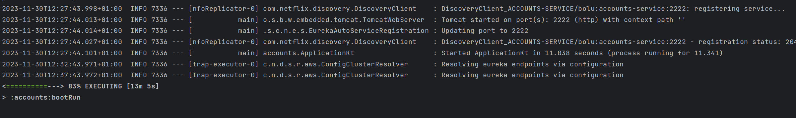

`./gradlew web:bootRun`
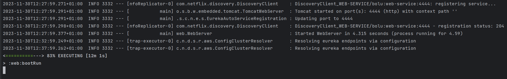

## THE SERVICE REGISTRATION SERVICE HAS THESE TWO SERVICES REGISTERED ##
 In http://localhost:8761/ you can see the dashboard of the registration server.
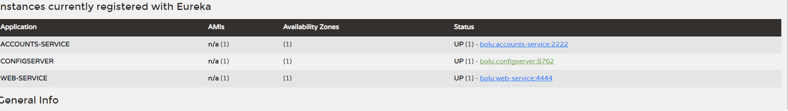

## UPDATE THE CONFIG REPOSITORY SO THAT THE ACCOUNTS SERVICE USES NOW THE PORT 3333 ##
https://github.com/boluLi/lab6-microservices-config-repo/commit/a71a053653572dc5dd9e6186e1469be0566c73a6

`server:
port: 3333   # HTTP (Tomcat) port`

## RUN A SECOND INSTANCE OF THE ACCOUNTS SERVICE USING THE NEW CONFIGURATION ##

`./gradlew accounts:bootRun`
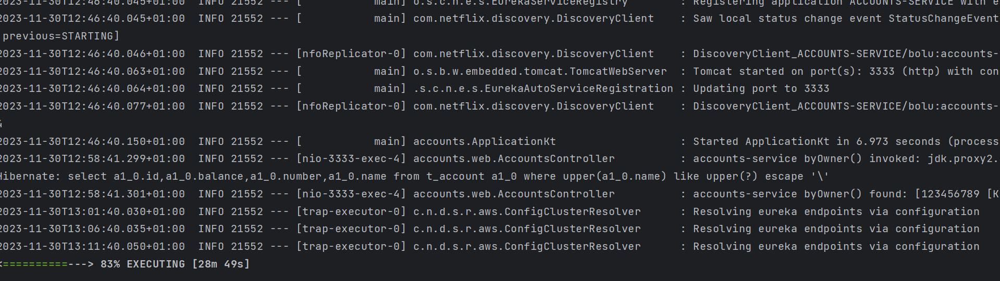

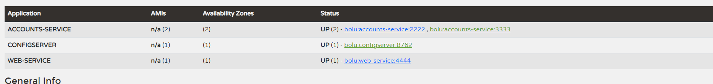
Notice the account-service is registered twice in the dashboard.

## WHAT HAPPENS WHEN YOU KILL THE SERVICE ACCOUNTS (2222) AND DO REQUESTS TO WEB? ##

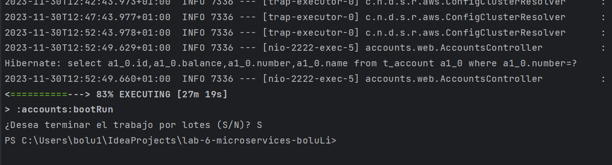

After killing the account service, first the eureka dashboard doesnt detect the account(2222) was not running anymore,it 
make sense now the red warning '**EMERGENCY! EUREKA MAY BE INCORRECTLY CLAIMING INSTANCES ARE UP WHEN THEY'RE NOT. RENEWALS ARE LESSER THAN THRESHOLD AND HENCE THE INSTANCES ARE NOT BEING EXPIRED JUST TO BE SAFE.**'.
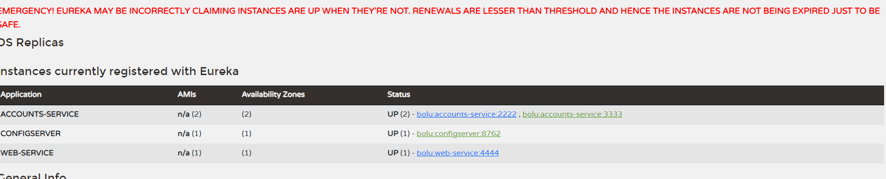
Try to get info from account(2222)
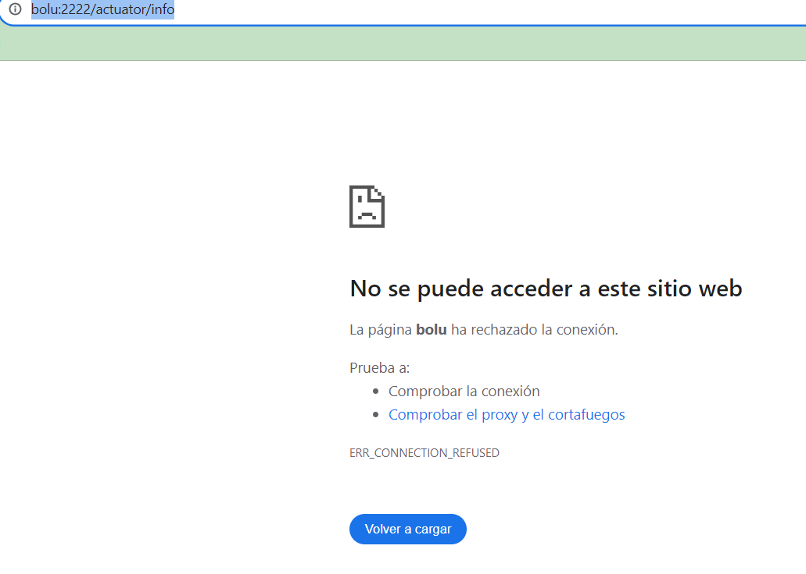

And some request to web service doesn't work either.
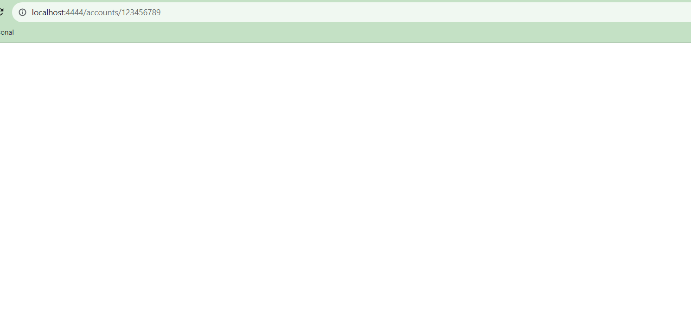
Request of Account 123456789 doesn't work,but search and account owner still working.
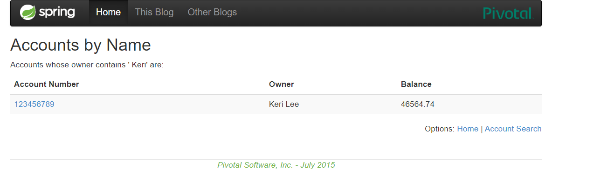
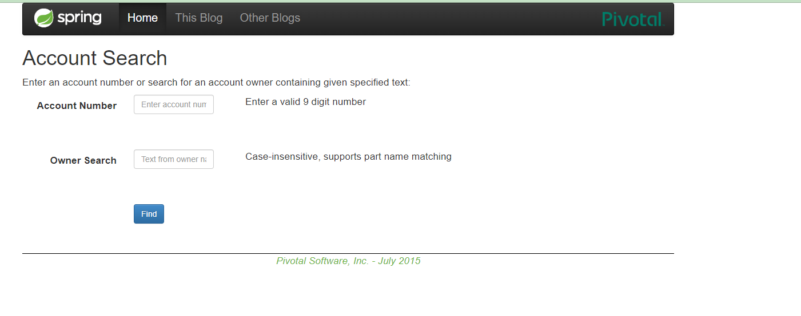

## CAN THE WEB SERVICE PROVIDE INFORMATION ABOUT THE ACCOUNTS AGAIN? WHY? ##
Search actually works (only the frontend) cause doesn't need to connect to account service, but the request of account 123456789 
and the owner info need to connect to account Service,so what happens is Eureka server still think the account(2222) is running
so when web service try to connect to account service it will connect to the account(2222) or account(3333) randomly, 
the request will fail if it connects to account(2222) because it is not running anymore but if it connects to account(3333) it will work.

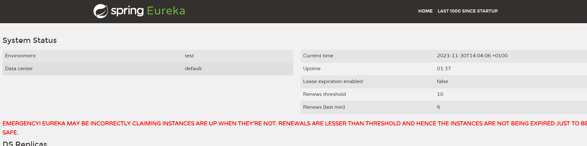

The way to fix the inconstency is to  enable the Lease expiration and make the account send "heartbeat" 
to eureka server every 30s.